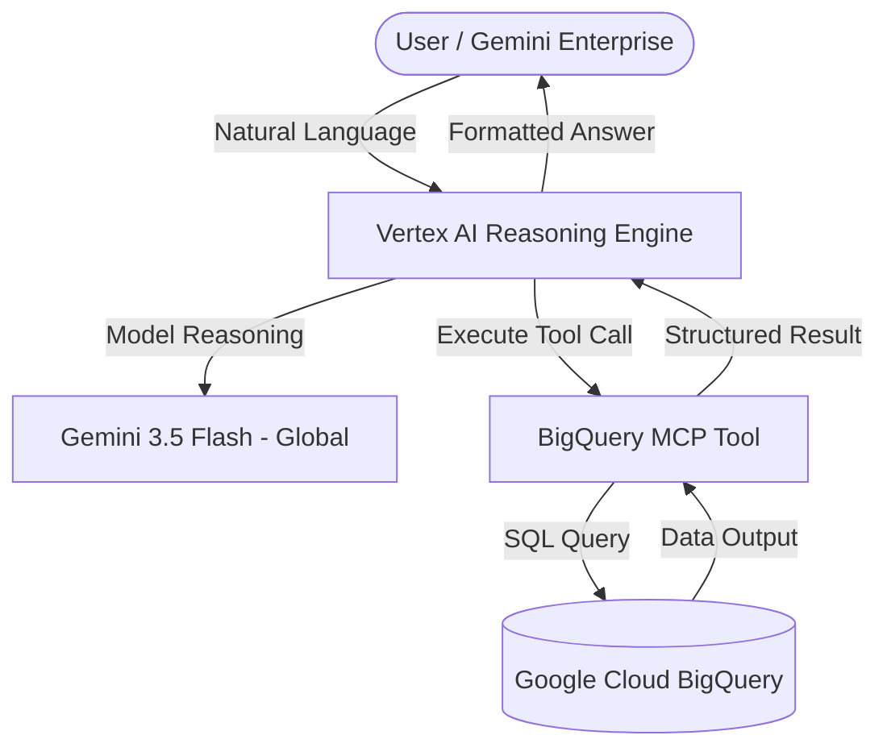

# IMDb BigQuery Analytics Agent (ADK Demo)

A template and demo of an autonomous AI Agent built on top of the **Google Agent Development Kit (ADK)**. This agent acts as a specialized data analyst capable of querying the public IMDb dataset in Google Cloud BigQuery using natural language. It handles SQL generation, execution, and data formatting autonomously.

The agent uses **Gemini 3.5 Flash** with global endpoint routing, making it robust against regional limitations when deployed to Google Cloud Agent Engine.

---

## Architecture Overview



---

## Directory Structure

```text
imdb-bq-agent-demo/
├── agent/
│   ├── __init__.py
│   ├── agent.py          # Core LlmAgent and CustomGemini definitions
│   ├── config.py         # Agent name and metadata configuration
│   └── prompt.py         # System instructions, database schemas, and constraints
├── scripts/
│   └── deploy.py         # Automation script for IAM setup and cloud deployment
├── requirements.txt      # Python dependencies
└── README.md             # Setup and deployment instructions
```

---

## Setup & Configuration Guide

### 1. Prerequisites
- **Python**: Python 3.10 to 3.13 installed.
- **Google Cloud SDK (`gcloud` CLI)**: Installed and authenticated to your target project.
- **Billing Project**: A GCP project with BigQuery API and Vertex AI API enabled.

### 2. Required IAM Roles
The agent requires a runtime Service Account with permissions to run BigQuery queries and query the public IMDb datasets. The `scripts/deploy.py` script automatically creates a Service Account (`imdb-bq-agent-sa`) and assigns the following roles:
- `roles/aiplatform.user` (Vertex AI runtime)
- `roles/agentregistry.viewer` (Access to MCP server metadata)
- `roles/bigquery.dataViewer` (Read IMDb public tables)
- `roles/bigquery.jobUser` (Submit query jobs in your billing project)
- `roles/bigquery.user` (Execute BigQuery jobs)
- `roles/serviceusage.serviceUsageConsumer` (Consumer quota usage)
- `roles/telemetry.admin` (Telemetry and logs)

---

## Deployment & Running Instructions

### 1. Set Environment Variables
Configure the following environment variables to target your Google Cloud project and environment:

```bash
# Your target billing project ID
export GOOGLE_CLOUD_PROJECT="your-gcp-project-id"

# Your target deployment region (e.g., us-central1, europe-west4)
export GOOGLE_CLOUD_LOCATION="your-region"

# The Resource Name of the MCP Server registered in your project
export MCP_SERVER_NAME="agentregistry-xxxxxxxx-xxxx-xxxx-xxxx-xxxxxxxxxxxx"
```

### 2. Local Testing
To test the agent locally before deploying to the cloud, install dependencies, activate your virtual environment, and execute using the ADK's `InMemoryRunner`:

```bash
# Install dependencies
pip install -r requirements.txt

# Run the agent in interactive shell mode using ADK CLI
adk run agent
```

### 3. Deploy to Agent Engine
To package, register, and deploy the agent as a live Vertex AI Reasoning Engine, run the deployment script:

```bash
python3 scripts/deploy.py
```

Upon successful deployment, the script will output the deployed **Reasoning Engine Resource ID** and a direct **A2A Agent Card URL**:

```text
============================================================
✅ Agent Engine Deployment Successful!
Agent ID: 6531046292431306752

🔗 A2A Agent Card URL (for Gemini CLI integration):
https://<region>-aiplatform.googleapis.com/v1beta1/projects/<project-id>/locations/<region>/reasoningEngines/<agent-id>/a2a
============================================================
```

---

## Exposing to Gemini Enterprise

Once the agent is running as a Vertex AI Reasoning Engine, you can integrate it directly with **Gemini Enterprise / Workspace Extensions**:

1. **Verify Registration**: Verify that the deployed Reasoning Engine is visible in the Vertex AI console under the "Reasoning Engines" (or Agents) playground.
2. **Access Control**: Ensure that the users or service accounts querying the agent have the Vertex AI User (`roles/aiplatform.user`) role assigned.
3. **Connect Gemini Extension**: Use the generated **A2A Agent Card URL** to register the agent in your organization's Gemini Enterprise extension console, allowing team members to summon this custom data analyst inside their workspace interface using `@imdb_bq_agent`.
